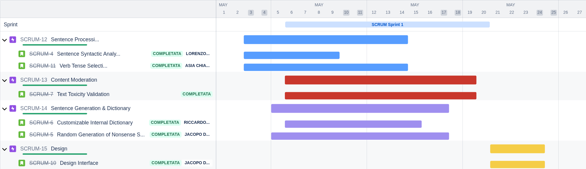

# Jira User Stories

### [Link to Jiras project](https://jacopodilauro04.atlassian.net/jira/software/projects/SCRUM/boards/1/backlog)

## Time Line

---

## Epic: Content Moderation

### 1. SCRUM-1 - Text Toxicity Validation  
**Description**: *As a user*, *I want* the generated sentence to be automatically checked for toxicity, *so that* I can ensure the generated content is appropriate for all users.

**Acceptance Criteria**:
- After sentence generation, the system uses Google Cloud’s `moderateText` API to evaluate toxicity.
- Toxicity results are clearly displayed.
- If the sentence is classified as toxic, a clear notification is shown.

---

## Epic: Sentence Processing

### 3. SCRUM-2 - Sentence Syntactic Analysis  
**Description**: *As a user*, *I want* to input a sentence and obtain a detailed syntactic analysis, *so that* I can clearly understand the grammatical structure of the sentence.

**Acceptance Criteria**:
- The user can input any English sentence.
- The system uses Google Cloud’s `analyzeSyntax` API to process the sentence.
- Nouns, verbs, and adjectives are extracted and displayed separately.

### 4. SCRUM-11 - Verb Tense Selection  
**Description**: *As a user*, *I want* to choose whether the generated sentence should be in past, present, or future tense, *so that* the sentence fits the desired time frame.

**Acceptance Criteria**:
- The user can select past, present, or future tense.
- Verbs are correctly conjugated based on the chosen tense.
- The sentence maintains temporal grammatical consistency.

---

## Epic: Sentence Generation & Dictionary

### 5. SCRUM-3 - Customizable Internal Dictionary  
**Description**: *As a user*, *I want* to be able to add terms to the internal dictionaries (nouns, verbs, adjectives), *so that* they can be reused in future sentence generations.

**Acceptance Criteria**:
- Before initial analysis, the system proposes adding the newly identified terms to internal dictionaries.
- The user confirms the addition.
- In subsequent sentence generations, the new terms are effectively available and used.

### 6. SCRUM-4 - Random Generation of Nonsense Sentences  
**Description**: *As a user*, *I want* the system to generate grammatically correct random sentences using predefined templates, *so that* I can explore creative linguistic combinations in a fun and useful way.

**Acceptance Criteria**:
- The system randomly chooses a template from the available templates (e.g., "The [noun] [verb] the [adjective] [noun].") with more than 100 templates.
- The system uses extracted terms from the initial sentence, adding random terms from internal dictionaries if needed.
- The generated sentence is grammatically correct and clearly displayed to the user.

---

## Epic: Design

### 7. SCRUM-10 - Design Interface  
**Description**: *As a user*, *I want* the interface to have a modern and intuitive design, *so that* I can navigate and use the web application efficiently and enjoyably.

**Acceptance Criteria**:
- The UI follows modern design principles.
- Color scheme and visual elements are consistent and visually appealing.
- Tooltips or guidance are available for new users to understand features quickly.

